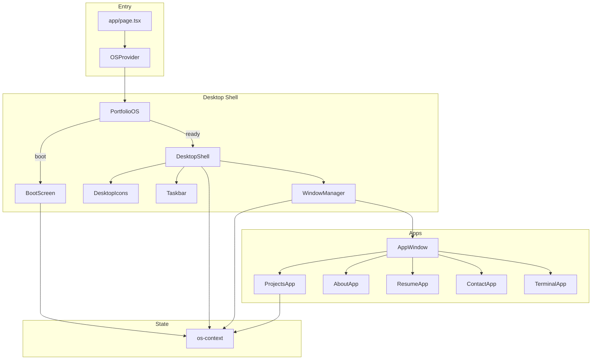

# AGENTS.md

Instructions for AI agents working on this codebase. Maintain a well-organized, modular structure so changes are easy to edit and update.

---

## Project Overview

- **What it is**: An OS-themed developer portfolio—boot screen, desktop, taskbar, draggable windows
- **Concept**: Two themes—**ops** (terminal-like, green accents) and **classic** (Win98 blue)
- **Entry point**: [app/page.tsx](app/page.tsx) renders `OSProvider` → boot flow → `DesktopShell`

---

## Tech Stack

| Category | Technology |
|----------|------------|
| Framework | Next.js 16 (App Router), React 19 |
| Language | TypeScript 5.7 |
| Styling | Tailwind CSS 4, shadcn/ui (Radix primitives) |
| State | React Context + reducer in [lib/os-context.tsx](lib/os-context.tsx) |
| Path alias | `@/*` → project root |

---

## Directory Layout

```
app/              - Next.js routes and layout (page.tsx, layout.tsx)
app/globals.css   - Single source of truth for styles (use this; ignore styles/globals.css)
components/
  os/             - OS shell: boot-screen, desktop-shell, taskbar, start-menu,
                    window-manager, app-window, desktop-icons
  os/apps/        - Content per app: projects-app, about-app, resume-app,
                    contact-app, terminal-app
  ui/             - shadcn primitives (do not modify unless adding a component)
lib/              - Shared logic: os-context, utils.ts (cn)
hooks/            - Reusable hooks: use-mobile, use-toast
```

---

## Conventions

### Naming
- Components: PascalCase
- Files: kebab-case (`desktop-shell.tsx`, `projects-app.tsx`)
- Actions: SCREAMING_SNAKE_CASE
- App IDs: lowercase (`"projects"`, `"about"`, etc.)

### Imports
- Use `@/components`, `@/lib`, `@/hooks` (see [components.json](components.json))
- Use `cn()` from `@/lib/utils` for Tailwind class composition

### OS-specific patterns
- Add `"use client"` to interactive OS and app components
- Use `useOS()` for state and actions
- Use `isClassic = state.theme === "classic"` for theme-based styling

---

## Architecture



**Data flow**: All OS shell and app components read state and actions via `useOS()` from [lib/os-context.tsx](lib/os-context.tsx). `WindowManager` maps `AppId` → component via `APP_COMPONENTS`.

---

## Modularity: Adding a New App

To add a new app, update these places in order:

1. **[lib/os-context.tsx](lib/os-context.tsx)**: Add `AppId` to the union, add to `APP_DEFAULTS`, add to `getInitialPosition` base map
2. **components/os/apps/\<name\>-app.tsx**: Create component (reads `useOS()`, no props)
3. **[window-manager.tsx](components/os/window-manager.tsx)**: Import and add to `APP_COMPONENTS`
4. **[start-menu.tsx](components/os/start-menu.tsx)**: Add to `MENU_APPS`
5. **[desktop-icons.tsx](components/os/desktop-icons.tsx)**: Add to `ICONS` (with `appId`)

---

## Adding State or Actions

- Add types and reducer cases in [lib/os-context.tsx](lib/os-context.tsx) only
- Do not spread state logic into components; keep it centralized

---

## Styling

- Extend CSS variables in [app/globals.css](app/globals.css) (`:root`, `.theme-classic`) instead of hardcoding colors
- Reuse existing utilities (`.scanlines`, `.ops-glow`, `.window-drag`, `.desktop-icon`) when applicable

---

## Anti-patterns to Avoid

- Do not modify `components/ui/` unless adding a shadcn component
- Do not duplicate state logic outside `lib/os-context.tsx`
- Do not hardcode colors; use CSS variables or theme checks
- Keep apps as thin presenters; put data/config in `lib` or inside the app file if small
